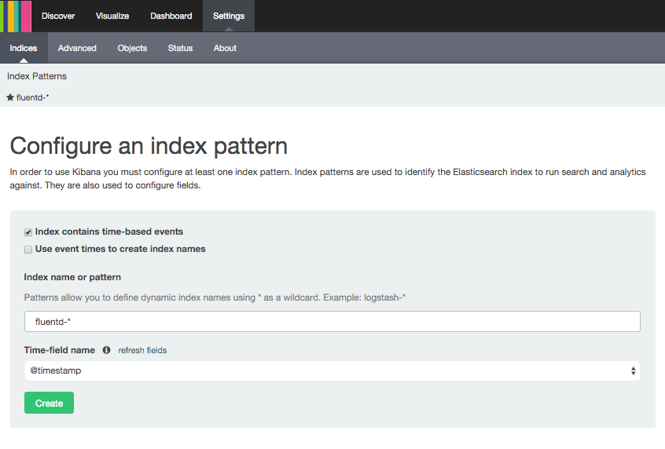
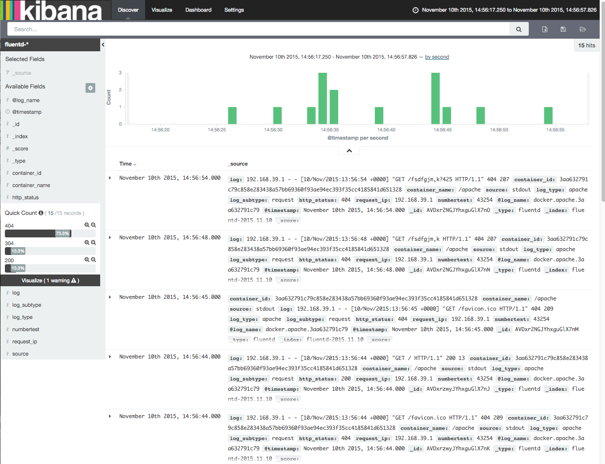
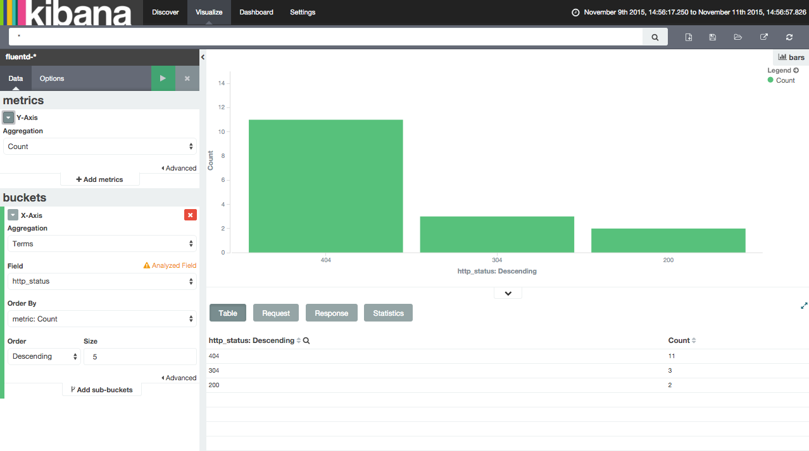
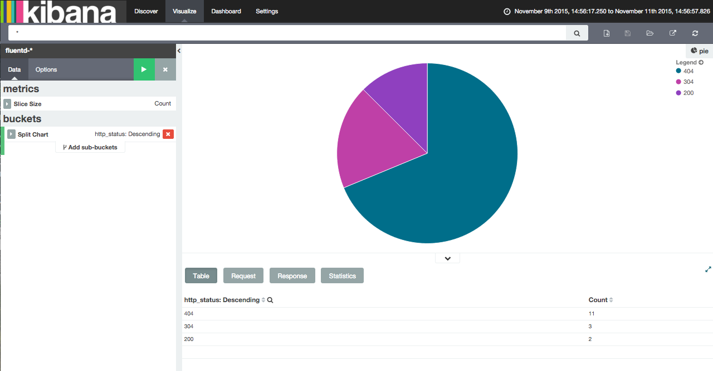
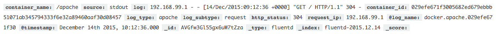
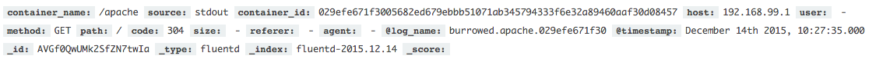

# Example: docker-compose + fluentd logging

This example shows how to use the docker fluentd log driver with docker-compose.

## How to use

### Deploy

First we need to deploy the __monitoring stuff__:

```bash
docker-compose -f monitor.yml up
```

It uses three containers: __fluentd__, __elasticsearch__ and __kibana__. All those containers use the host network stack (to make things easier).

Then we can deploy the application:

```bash
docker-compose -f application.yml up
```

This run an __apache__ container that forward the logs to the fluentd listening on localhost.

The directive `fluentd-tag: "docker.apache.{{.ID}}"` make log lines to be tagged with `docker.apache.<contianerID>`.

### Dashboard

Kibana should be listening on `http://<dockerhostip>:5601`.

The first thing to do is configure the indexs to be readed. Go to _Settings_->_Indices_ and write the pattern `fluentd-*`. Press _Create_.



After this, it is possible to create visualizations.

NOTE: it is necessary to access `http://<dockerhostip>` to generate event and populate elasticsearch.

Some screenshots:






## Configuration

The fluentd configuration file is placed in `fluentd/volumes/etc/cloudopting.conf`.

It is divided in three parts.

### `source`

Open port where to receive __docker__ input.


### `filter`

There are three filters.

The first one discard entries that aren't requests.

The second one add two fields: `log_type` `log_subtype`

The third one parses the log string and extracts the fields `http_status` and `request_ip`


### `match`

Set the output (__elasticsearch__).

## Things that can be improved

### Datatypes mapping from fluentd to elasticsearch

Since we are using the [docker log driver](http://docs.docker.com/engine/reference/logging/fluentd/), we cannot use [parser plugins](http://docs.fluentd.org/articles/parser-plugin-overview) to extract the information from the log. This is because the log is received encapsulated in a field called `log` and alongside other fields that docker insert. It is possible to create a new plugin that do the work, but the default are useless for us.

Currently, all data parsed with [filter_record_transformer](http://docs.fluentd.org/articles/filter_record_transformer) is mapped as string. This could be an inconvenience for performance in data analysis in kibana.

### Storing in elasticsearch only the data we want

We are saving all the information that docker log driver give us. Probably, we'll not need information like the complete log line. It is convenient to discart the information we don't need in Fluentd in order to save storage, processing and headaches.

## UPDATE: using out_burrow plugin

Using [out_burrow](https://github.com/vanilla/fluent-plugin-burrow) we can parse in a easier way and even replace the entire event.

We solve the 'data types mapping' issue for standard logs, and we could also solve 'store only the data we want' using the proper `action` parameter.

This is using the __record_transformer filter__:
```apache
<source>
  type forward
  port 24224
  bind 0.0.0.0
</source>

# Sample of the log string we want to analyse:
# 192.168.39.1 - - [10/Nov/2015:12:57:52 +0000] "GET /favicon.ico HTTP/1.1" 404 209

# Accept requests and Deny other apache logs
<filter docker.apache.*>
  type grep
  regexp1 log ^\s*(?:[0-9]{1,3}\.){3}[0-9]{1,3}.*\[.+/.+/.{4}:..:..:..\s+\+....\]\s*"[A-Z]*\s+/.*\s+HTTP/1.1"\s+[0-9]{3}\s+.*
</filter>

# Add field logtype
<filter docker.apache.*>
  type record_transformer
  <record>
    log_type ${tag_parts[1]}
    log_subtype "request"
  </record>
</filter>

# Add fields status and origin IP
<filter docker.apache.*>
  type record_transformer
  enable_ruby
  <record>
    http_status ${%r[^\s*(?:[0-9]{1,3}\.){3}[0-9]{1,3}.*\[.+/.+/.{4}:..:..:..\s+\+....\]\s*"[A-Z]*\s+/.*\s+HTTP/1.1"\s+([0-9]{3})\s+.*].match(log)[1].to_i}
    request_ip ${%r[^\s*((?:[0-9]{1,3}\.){3}[0-9]{1,3}).*\[.+/.+/.{4}:..:..:..\s+\+....\]\s*"[A-Z]*\s+/.*\s+HTTP/1.1"\s+[0-9]{3}\s+.*].match(log)[1]}
  </record>
</filter>

<match docker.apache.*>
  type copy
  <store>
    type elasticsearch
    host localhost
    port 9200
    include_tag_key true
    tag_key @log_name
    logstash_format true
    logstash_prefix "fluentd"
    flush_interval 10s
  </store>
</match>
```

elasticsearch data:


This is using the __out_burrow__ plugin:

```apache
<source>
  type forward
  port 24224
  bind 0.0.0.0
</source>

# Accept requests and Deny other apache logs
<filter docker.apache.*>
  type grep
  regexp1 log ^\s*(?:[0-9]{1,3}\.){3}[0-9]{1,3}.*\[.+/.+/.{4}:..:..:..\s+\+....\]\s*"[A-Z]*\s+/.*\s+HTTP/1.1"\s+[0-9]{3}\s+.*
</filter>

<match docker.apache.*>
    type burrow
    key_name log
    format apache2
    remove_prefix docker
    add_prefix burrowed
    action overlay
</match>

<match burrowed.apache.*>
  type copy
  <store>
    type elasticsearch
    host localhost
    port 9200
    include_tag_key true
    tag_key @log_name
    logstash_format true
    logstash_prefix "fluentd"
    flush_interval 10s
  </store>
</match>
```

elasticsearch data:



## References:

- http://www.fluentd.org/guides/recipes/docker-logging
- https://github.com/fluent/fluentd-docker-image
- https://www.digitalocean.com/community/tutorials/how-to-centralize-your-docker-logs-with-fluentd-and-elasticsearch-on-ubuntu-14-04
- https://docs.docker.com/compose/yml/#log-driver
- http://www.fluentd.org/guides/recipes/elasticsearch-and-s3
